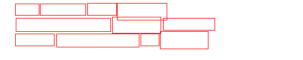
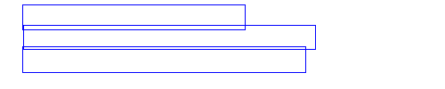

<div align="center">
  <div align="center">
    <h1><b>Merge Text Boxes</b></h1>
  </div>
  <a href="">=3.6,<3.12-aff.svg"></a>
  <a href=""></a>
<a href="https://pypi.org/project/merge_text_boxes/"></a>
<a href="https://pepy.tech/project/merge_text_boxes"></a>
  <a href="https://semver.org/"></a>
  <a href="https://github.com/psf/black"></a>
  <a href="https://github.com/SWHL/MergeTextBoxes/blob/8da071f678d4e3d0681fff8b213a5aa9c1a96073/LICENSE"></a>

  [简体中文](./docs/README_zh.md) | English
</div>

### Introduction
This repo is mainly used to merge peer text boxes. The code is modified from the [merge_text_boxs](https://github.com/zcswdt/merge_text_boxs) project and further organized and expanded.

### Installation
```bash
pip install merge_text_boxes
```

### Usage
```python
import copy

import cv2
import numpy as np

from merge_text_boxes import MergeTextBoxes

rects = [
    [144, 5, 192, 25],
    [25, 6, 64, 25],
    [66, 6, 141, 25],
    [193, 5, 275, 33],
    [269, 30, 354, 50],
    [26, 30, 182, 52],
    [185, 28, 265, 55],
    [25, 56, 89, 76],
    [93, 56, 229, 78],
    [232, 56, 262, 76],
    [264, 52, 343, 81],
]

show_image = np.zeros([100, 500, 3], np.uint8) + 255

connector = MergeTextBoxes(max_dist=15, overlap_threshold=0.2)
new_rects = connector(rects, 500)

tmp_img = copy.deepcopy(show_image)
for rect in rects:
    cv2.rectangle(tmp_img, (rect[0], rect[1]), (rect[2], rect[3]), (0, 0, 255), 1)
cv2.imwrite("origin.png", tmp_img)

for rect in new_rects:
    cv2.rectangle(show_image, (rect[0], rect[1]), (rect[2], rect[3]), (255, 0, 0), 1)

cv2.imwrite("res.png", show_image)
```

### Visualization
Before merging：



After merging：




### Acknowledgements
- [OCR文字检测框的合并](https://blog.csdn.net/jhsignal/article/details/107840145)
- [merge_text_boxs](https://github.com/zcswdt/merge_text_boxs)

### Contributing
Pull requests are welcome. For major changes, please open an issue first
to discuss what you would like to change.

Please make sure to update tests as appropriate.

### [Sponsor](https://rapidai.github.io/RapidOCRDocs/docs/sponsor/)
If you want to sponsor the project, you can directly click the **Buy me a coffee** image, please write a note (e.g. your github account name) to facilitate adding to the sponsorship list below.

<div align="left">
   <a href="https://www.buymeacoffee.com/SWHL"></a>
</div>

### License
This project is released under the [Apache 2.0 license](../LICENSE).